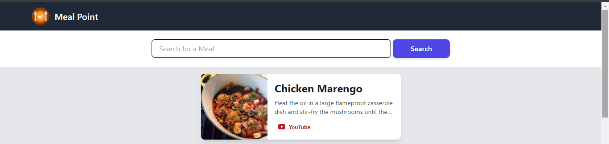

# Meal-Point

- Its's meal app where we can fine any food and how to make
  

## Find Food

- We can simply search any food name and chose any one. and youtube link is available so can watch the video how its make.
  

  ## Technologies Used

- React.js
- Vite
- Axios for fetching data from the OMDb API
- Tailwind CSS for styling

## Installation

```
npm install
```

## Dev

```
npm run dev
```

## Build

```
npm run build
```

## Acknowledgements

- [ThemealDB API](https://www.themealdb.com/api.php) - Free Recipe API Support
- [Tailwind CSS](https://tailwindcss.com/) - A utility-first CSS framework for quickly building custom designs.
- [React Router](https://reactrouter.com/) - Declarative routing for React applications.
- [Vite](https://vitejs.dev/) - Next Generation Frontend Tooling
